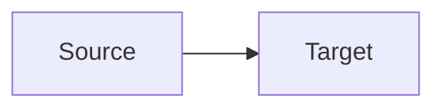

# Marp Mermaid Engine

A custom Marp Core 5 engine that renders fenced Mermaid diagrams with standard Mermaid.js through `@mermaid-js/mermaid-cli`. This supports Mermaid syntax such as `classDef` and `class` while keeping diagram source in Markdown and inlining the resulting SVGs in Marp output.

The engine also installs Marp Core's MathJax, KaTeX, and Shiki plugins. For a cold document render, it launches one Puppeteer browser and reuses it across uncached Mermaid diagrams instead of starting a browser for each diagram. It also keeps a bounded in-memory SVG cache, so unchanged diagrams can be reused during later renders in the same engine process; a new preview process starts with a cold cache.

## Requirements

- Node.js 20 or newer
- Marp CLI 3.2.1 or newer (for async engine rendering)
- Marp Core 5
- Puppeteer `^23`–`^25` (peer dependency). Puppeteer normally downloads a compatible managed browser, so a separate system Chrome/Chromium installation is usually unnecessary. If that download is disabled or unavailable, configure Puppeteer to use an existing compatible browser.

## Install

The GitHub repository is public. Install it globally with npm:

```sh
npm install -g github:shanemcd/marp-mermaid-engine
```

The package is marked `"private": true` to prevent accidental `npm publish`; this does not prevent installing it from GitHub. The engine does not bundle a theme. For global use with the Red Hat companion assets, install both packages into the same global npm root:

```sh
npm install -g github:shanemcd/marp-mermaid-engine github:shanemcd/marp-theme-redhat
```

## Use with Marp CLI

Marp CLI resolves engine package specifiers from the Markdown file and current working directory, not npm's global package directory. Pass the engine file path using npm's global root:

```sh
marp --engine "$(npm root -g)/marp-mermaid-engine/engine.mjs" --preview slides.md
```

To update the engine, run the same `npm install -g` command again.

## Theme-provided Mermaid defaults

Mermaid configuration and CSS belong with the Marp theme, not in special deck fences. Put the companion assets beside the theme stylesheet and reference them with metadata comments:

```text
marp-theme-redhat/
├── theme.css
├── mermaid.config.json
└── mermaid.css
```

```css
/* @theme redhat */
/* @marp-mermaid-config ./mermaid.config.json */
/* @marp-mermaid-css ./mermaid.css */
```

Register the theme CSS with Marp CLI's `themeSet` option as well. For a project-local setup, install both packages:

```sh
npm install --save-dev github:shanemcd/marp-mermaid-engine github:shanemcd/marp-theme-redhat
```

Then create `marp.config.mjs` in the project root:

```js
import { createRequire } from 'node:module'

const require = createRequire(import.meta.url)

export default {
  engine: require.resolve('marp-mermaid-engine'),
  themeSet: require.resolve('marp-theme-redhat/theme.css'),
}
```

Select the theme in the deck frontmatter and use ordinary Mermaid fences:

````markdown
---
marp: true
theme: redhat
---


````

Do not add `mermaid-config` or `mermaid-css` fences to the deck. The engine matches the frontmatter theme name to the stylesheet's `@theme` declaration, resolves the companion paths relative to that stylesheet, and applies the config and CSS to every Mermaid diagram in the render (`mermaidConfig` and `myCSS`, respectively). It finds the stylesheet from Marp's `themeSet`, `MARP_MERMAID_THEME_SET`, or the conventional package name `marp-theme-<theme-name>`. For a differently named package, set `MARP_MERMAID_THEME_SET` to the theme CSS path. The theme must still be registered with Marp CLI to style slides. Themes without these metadata comments render with Mermaid defaults; individual diagrams may use Mermaid directives for intentional local overrides.

## Test

```sh
npm test
```

The smoke test renders two identical diagrams containing `classDef`, checks that they become inline SVGs, and verifies that each SVG has a unique ID.
